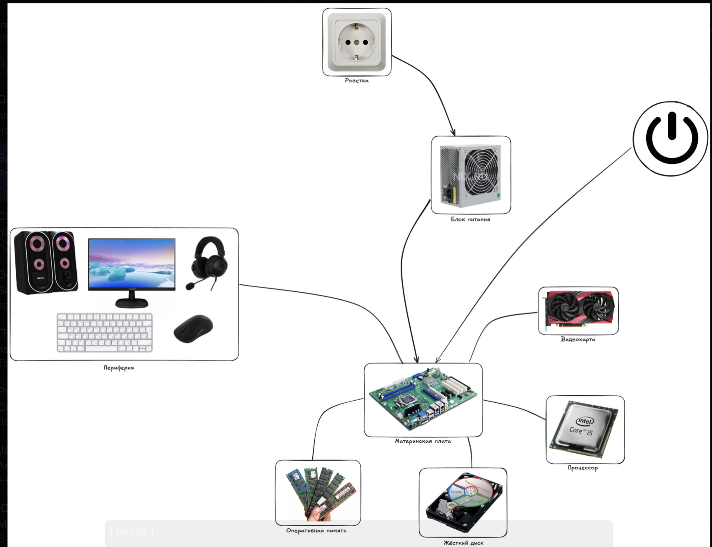

# Практика — Память и устройство компьютера

---

## Устройство компьютера

- Посмотреть на изображение со схемой компьютера

- Пробежаться по каждому элементу на схеме и проговорить для чего он нужен
- Ответить себе на вопрос — что именно происходит в компьютере в момент когда ты двойным кликом открываешь программу
- Проговорить чем отличается процессор с одним ядром от процессора с четырьмя ядрами, и почему это важно

---

## Оперативная память и жёсткий диск

- Проговорить для чего в компьютере нужен жёсткий диск, а для чего оперативная память, и как они работают в связке
- Ответить себе на вопрос — почему нельзя обойтись только оперативной памятью или только жёстким диском, если оба устройства умеют хранить данные
- Ответить себе на вопрос — в какой момент программа с жёсткого диска загружается в оперативную память, и зачем это вообще нужно делать
- Проговорить что происходит с данными в оперативной памяти когда компьютер выключают

---

## Процессы и потоки

- Проговорить чем отличается программа от процесса
- Ответить себе на вопрос — если открыть браузер два раза, это один процесс или два
- Проговорить что такое поток и чем он отличается от процесса
- Ответить себе на вопрос — могут ли два потока одного процесса одновременно менять одну переменную, и что при этом может пойти не так

---

## Практика

- Написать программу на Go которая создаёт переменную и выводит её значение и адрес в памяти

